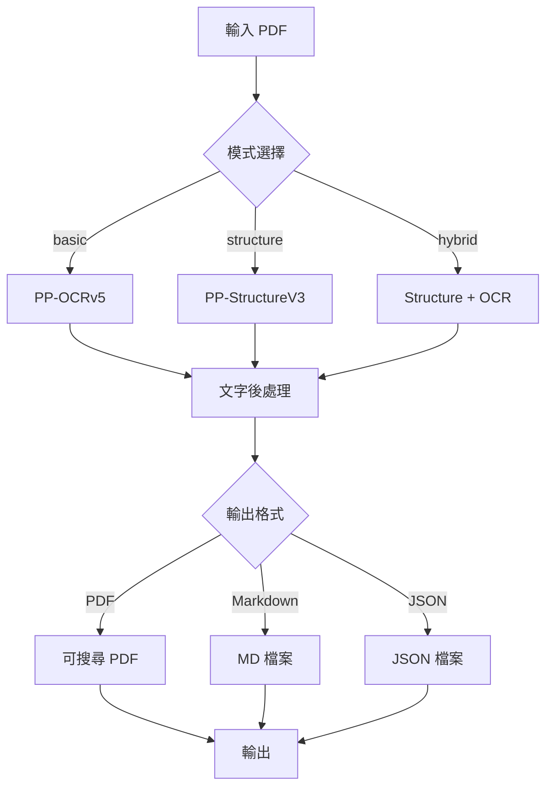

# PaddleOCR Toolkit 架構說明

> 最後更新：2024-12-13

---

## 專案概述

**專案名稱**：PaddleOCR Toolkit  
**類型**：Python CLI 工具 + 套件  
**功能**：基於 PaddleOCR 的多功能文件辨識與處理工具  
**授權**：MIT

---

## 專案結構

```
paddleocr-toolkit/
├── paddle_ocr_tool.py        # 主程式（CLI，2600 行）⚠️
├── pdf_translator.py          # PDF 翻譯模組
├── config.yaml                # 設定檔範本
├── paddleocr_toolkit/         # Python 套件
│   ├── __init__.py            # 套件入口（延遲載入）
│   ├── __main__.py            # CLI 入口（python -m）
│   ├── core/                  # 核心功能
│   │   ├── __init__.py
│   │   ├── models.py          # OCRResult, OCRMode 資料模型
│   │   ├── pdf_generator.py   # PDF 生成器（69% 覆蓋率）
│   │   ├── pdf_utils.py       # 共用 PDF 工具（9 個函數，70% 覆蓋率）
│   │   └── config_loader.py   # YAML 設定載入（80% 覆蓋率 ✅）
│   ├── processors/            # 資料處理器
│   │   ├── __init__.py
│   │   ├── text_processor.py      # 文字處理（90% 覆蓋率 ✅）
│   │   ├── pdf_quality.py         # PDF 品質偵測（70% 覆蓋率）
│   │   ├── image_preprocessor.py  # 影像前處理（66% 覆蓋率）
│   │   ├── batch_processor.py     # 批次處理（82% 覆蓋率 ✅）
│   │   ├── glossary_manager.py    # 術語管理（83% 覆蓋率 ✅）
│   │   ├── ocr_workaround.py      # OCR 替代方案（76% 覆蓋率）
│   │   └── stats_collector.py     # 統計收集（80% 覆蓋率 ✅）
│   └── outputs/               # 輸出格式處理
│       └── __init__.py
├── tests/                     # 測試（76% 覆蓋率，147 個測試）
├── requirements.txt           # Python 依賴
└── README.md                  # 專案說明
```

---

## 核心模組說明

### 1. `core` - 核心功能

#### `models.py`

**職責**：定義資料模型

```python
@dataclass
class OCRResult:
    text: str                     # 識別的文字
    confidence: float             # 信賴度 (0-1)
    bbox: List[List[float]]       # 邊界框座標
    
    @property
    def x(self) -> float
    def y(self) -> float
    def width(self) -> float
    def height(self) -> float
```

**使用場景**：所有 OCR 結果都使用此資料結構

---

#### `pdf_generator.py`

**職責**：生成可搜尋的 PDF

**關鍵類別**：

```python
class PDFGenerator:
    def __init__(self, output_path: str, debug_mode: bool = False)
    def add_page(self, image_path: str, ocr_results: List[OCRResult])
    def add_page_from_pixmap(self, pixmap, ocr_results: List[OCRResult])
    def save(self)
    def _insert_invisible_text(self, page, result: OCRResult)
```

**重要功能**：

- 將 OCR 結果疊加到 PDF 頁面
- 支援 JPEG 壓縮以減小檔案大小
- 支援 debug 模式（粉紅色文字層）

**已知限制**：

- 覆蓋率僅 69%，需更多測試
- 大檔案處理可能記憶體不足

---

#### `pdf_utils.py`

**職責**：共用 PDF 工具函數

**9 個工具函數**：

1. `pixmap_to_numpy()` - Pixmap 轉 numpy 陣列
2. `page_to_numpy()` - PDF 頁面轉 numpy 陣列
3. `create_pdf_page()` - 建立 PDF 頁面
4. `insert_image_to_page()` - 插入圖片到頁面
5. `save_pdf_document()` - 儲存 PDF 文件
6. `get_page_pixmap()` - 取得頁面 Pixmap
7. `open_pdf_document()` - 開啟 PDF 文件
8. `get_pdf_page_count()` - 取得 PDF 頁數
9. `close_pdf_document()` - 關閉 PDF 文件

**設計理念**：

- **DRY**：避免 Pixmap → numpy 轉換重複出現在 5+ 個地方
- **一致性**：統一的 PDF 操作介面

---

#### `config_loader.py`

**職責**：載入 YAML 設定檔

**載入順序**：

1. 預設設定
2. 使用者家目錄 `~/.paddleocr_toolkit/config.yaml`
3. 當前目錄 `config.yaml`
4. CLI 參數指定的檔案 `--config path/to/config.yaml`
5. 其他 CLI 參數（優先級最高）

---

### 2. `processors` - 資料處理器

#### `text_processor.py` ✅

**職責**：文字後處理

**主要功能**：

- `fix_english_spacing()` - 修復 OCR 英文空格問題
- 處理 CamelCase、合併單字、標點符號

**覆蓋率**：90% ✅

---

#### `pdf_quality.py`

**職責**：偵測 PDF 品質

**主要功能**：

- `detect_pdf_quality()` - 判斷是掃描件、模糊、文字 PDF
- 自動調整 DPI 設定（掃描件 → 300 DPI）

**覆蓋率**：70%

---

#### `image_preprocessor.py`

**職責**：影像前處理

**主要功能**：

- 對比度增強
- 二值化
- 銳化
- 去噪
- 傾斜校正

**覆蓋率**：66% ⚠️ 需改善
**已知問題**：未充分整合到主流程

---

#### `batch_processor.py` ✅

**職責**：批次處理

**主要功能**：

- `pdf_to_images_parallel()` - 多執行緒 PDF 轉圖片
- 支援進度回調

**覆蓋率**：82% ✅

---

#### `stats_collector.py` ✅

**職責**：統計資訊收集

**主要類別**：

- `PageStats` - 單頁統計
- `ProcessingStats` - 整體統計
- `StatsCollector` - 統計收集器

**覆蓋率**：80% ✅

---

## 關鍵設計決策

### 1. 循環依賴解決

**問題**：

- `paddleocr_toolkit` 需要使用 `paddle_ocr_tool.py` 的功能
- 但 `paddle_ocr_tool.py` 又依賴 `paddleocr_toolkit`

**解決方案**：延遲載入

```python
# paddleocr_toolkit/__init__.py
def get_paddle_ocr_tool():
    """延遲載入 paddle_ocr_tool，避免循環依賴"""
    global paddle_ocr_tool
    if paddle_ocr_tool is None:
        import paddle_ocr_tool as tool
        paddle_ocr_tool = tool
    return paddle_ocr_tool
```

---

### 2. 共用工具模組

**問題**：Pixmap → numpy 轉換在 5+ 個地方重複

**解決方案**：建立 `pdf_utils.py`

```python
def pixmap_to_numpy(pixmap) -> np.ndarray:
    """統一的 Pixmap 轉 numpy 陣列方法"""
    return np.frombuffer(pixmap.samples, dtype=np.uint8).reshape(
        pixmap.height, pixmap.width, pixmap.n
    )
```

---

### 3. 設定檔支援

**問題**：CLI 參數過多，使用不便

**解決方案**：`config.yaml` + `config_loader.py`

- 提供範本設定檔
- 支援多層級設定載入
- CLI 參數可覆蓋設定檔

---

## 資料流程

### OCR 處理流程



---

## 已知限制與改進方向

### 目前限制

1. **主程式過大**：`paddle_ocr_tool.py` 2600 行
   - 包含過多邏輯
   - 難以維護和測試

2. **模組未充分整合**：
   - `image_preprocessor` 未充分使用
   - `batch_processor` 可更好整合

3. **低覆蓋模組**：
   - `pdf_generator.py`: 69%
   - `image_preprocessor.py`: 66%
   - `pdf_utils.py`: 70%

### 改進方向

#### 短期（1-2 週）

- [ ] 提升測試覆蓋率至 80%
- [ ] 為低覆蓋模組新增測試

#### 中期（1-2 個月）

- [ ] 重構 `paddle_ocr_tool.py`
- [ ] 整合 `image_preprocessor` 到主流程
- [ ] 新增更多輸出格式

#### 長期（3+ 個月）

- [ ] Docker 容器化
- [ ] API 文件（Sphinx）
- [ ] Web UI
- [ ] 多語言支援

---

## 相依性管理

### 核心依賴

- `paddleocr`: OCR 引擎
- `PyMuPDF` (fitz): PDF 處理
- `opencv-python` (cv2): 影像處理
- `numpy`: 數值計算

### 開發依賴

- `pytest`: 測試框架
- `pytest-cov`: 覆蓋率報告
- `pytest-mock`: Mock 工具

---

## 效能考量

### 記憶體

- **問題**：大 PDF 處理可能記憶體不足
- **緩解**：分頁處理、及時釋放資源

### 速度

- **瓶頸**：OCR 辨識（GPU 可加速）
- **最佳化**：批次處理、平行化

---

*架構文件版本：v1.0*
