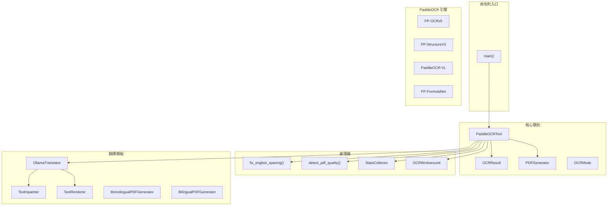
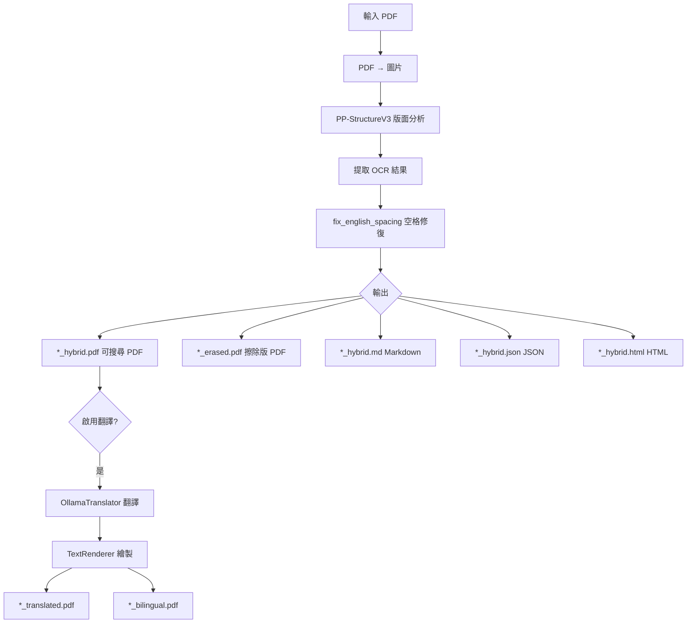
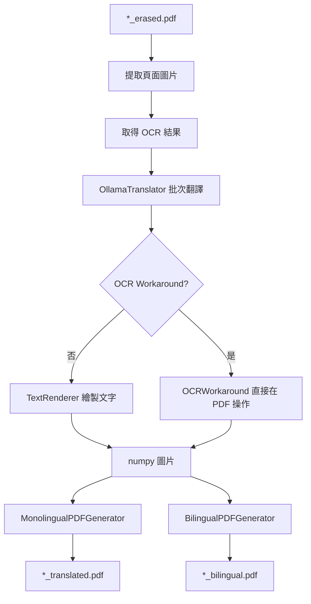

# PaddleOCR Toolkit - 程式碼架構藍圖

## 專案概覽

```
pdf/
├── paddle_ocr_tool.py      # 主程式入口（2627 行）
├── pdf_translator.py       # 翻譯模組（657 行）
├── paddleocr_toolkit/      # 核心套件
│   ├── core/              # 核心資料結構
│   └── processors/        # 處理器模組
├── tests/                 # 測試
└── README.md              # 檔案
```

---

## 模組架構圖



---

## 核心類別

### PaddleOCRTool（主類別）

| 方法 | 功能 | OCR 模式 |
|------|------|---------|
| `process_image()` | 處理單張圖片 | basic |
| `process_image_array()` | 處理 numpy 陣列 | basic |
| `process_pdf()` | 處理 PDF | basic |
| `process_structured()` | 結構化處理 | structure, vl |
| `process_formula()` | 公式識別 | formula |
| `process_hybrid()` | 混合模式 | hybrid |
| `process_translate()` | 翻譯 PDF | hybrid + translate |
| `_process_hybrid_pdf()` | 混合模式 PDF 處理（內部） | - |
| `_process_translation_on_pdf()` | 翻譯處理（內部） | - |

### OCRResult（資料結構）

```python
@dataclass
class OCRResult:
    text: str                    # 辨識的文字
    confidence: float            # 信賴度 (0-1)
    bbox: List[List[float]]      # 邊界框座標 [[x1,y1], [x2,y2], [x3,y3], [x4,y4]]
    
    @property x -> float         # 左上角 X 座標
    @property y -> float         # 左上角 Y 座標
    @property width -> float     # 邊界框寬度
    @property height -> float    # 邊界框高度
```

### PDFGenerator（PDF 生成器）

```python
class PDFGenerator:
    def __init__(output_path, debug_mode=False, compress_images=False, jpeg_quality=85)
    def add_page(image_path, ocr_results) -> bool
    def add_page_from_pixmap(pixmap, ocr_results) -> bool
    def save() -> bool
```

---

## 處理器模組

### paddleocr_toolkit/processors/

| 模組 | 類別/函式 | 功能 | 整合狀態 |
|------|----------|------|---------|
| `text_processor.py` | `fix_english_spacing()` | 英文空格修復 | ✅ |
| `pdf_quality.py` | `detect_pdf_quality()` | PDF 品質偵測 | ✅ |
| `stats_collector.py` | `StatsCollector` | 統計收集 | ✅ |
| `ocr_workaround.py` | `OCRWorkaround` | 翻譯備用 | ✅ |
| `batch_processor.py` | `pdf_to_images_parallel()` | 多執行緒轉換 | ❌ |
| `image_preprocessor.py` | `auto_preprocess()` | 圖片預處理 | ❌ |
| `glossary_manager.py` | `GlossaryManager` | 術語表管理 | ❌ |

---

## 翻譯模組

### pdf_translator.py

| 類別 | 功能 |
|------|------|
| `TranslatedBlock` | 翻譯區塊資料結構 |
| `OllamaTranslator` | Ollama 翻譯引擎 |
| `TextInpainter` | 文字區域擦除 |
| `TextRenderer` | 翻譯文字繪製 |
| `MonolingualPDFGenerator` | 純翻譯 PDF 生成 |
| `BilingualPDFGenerator` | 雙語對照 PDF 生成 |

---

## 處理流程

### Hybrid 模式流程



### 翻譯流程



---

## CLI 引數

### OCR 模式

| 引數 | 預設 | 說明 |
|------|------|------|
| `--mode` | basic | basic, structure, vl, formula, hybrid |

### 輸出選項

| 引數 | 說明 |
|------|------|
| `--searchable` | 生成可搜尋 PDF |
| `--markdown-output` | Markdown 輸出 |
| `--json-output` | JSON 輸出 |
| `--html-output` | HTML 輸出 |
| `--all` | 輸出所有格式 |

### 壓縮選項

| 引數 | 預設 | 說明 |
|------|------|------|
| `--no-compress` | False | 停用 JPEG 壓縮 |
| `--jpeg-quality` | 85 | JPEG 品質 (0-100) |

### 翻譯選項

| 引數 | 預設 | 說明 |
|------|------|------|
| `--translate` | False | 啟用翻譯 |
| `--source-lang` | auto | 來源語言 |
| `--target-lang` | en | 目標語言 |
| `--ollama-model` | qwen2.5:7b | Ollama 模型 |
| `--ocr-workaround` | False | 使用 OCR 補救模式 |

---

## 檔案大小

| 檔案 | 行數 | 位元組 |
|------|------|--------|
| paddle_ocr_tool.py | 2627 | 109KB |
| pdf_translator.py | 657 | 24KB |
| paddleocr_toolkit | ~1200 | ~50KB |
| **總計** | ~4500 | ~180KB |

---

## 依賴關係

```
paddle_ocr_tool.py
├── paddleocr (PaddleOCR 3.x)
│   ├── PP-OCRv5
│   ├── PP-StructureV3
│   ├── PaddleOCR-VL
│   └── PP-FormulaNet
├── paddleocr_toolkit
│   ├── core (OCRResult, PDFGenerator, OCRMode)
│   └── processors (fix_english_spacing, StatsCollector, ...)
├── pdf_translator.py
│   ├── OllamaTranslator
│   ├── TextRenderer
│   └── MonolingualPDFGenerator
├── PyMuPDF (fitz)
├── Pillow (PIL)
├── numpy
├── tqdm
└── wordninja (可選)
```
