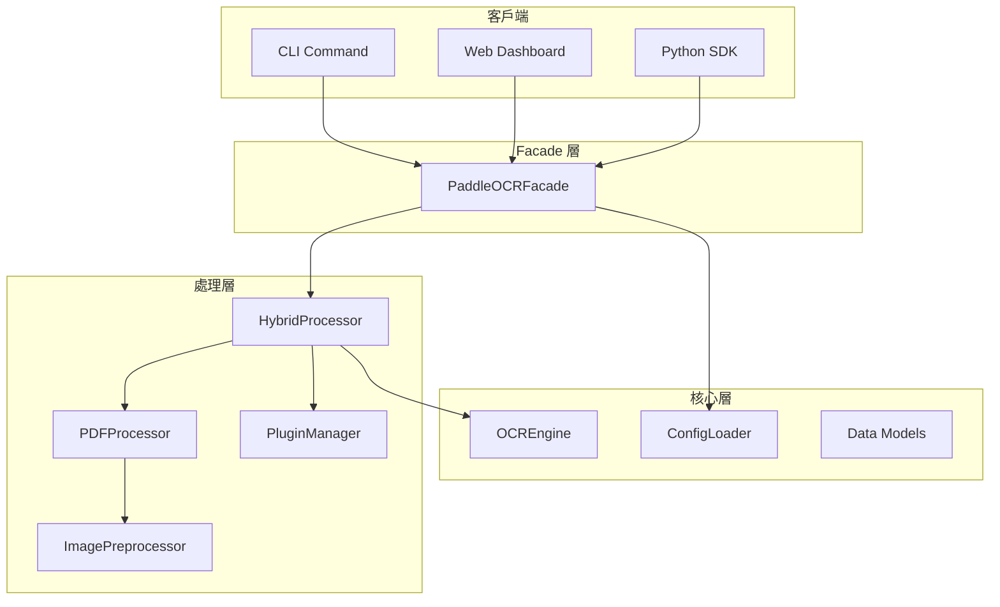

# PaddleOCR Toolkit - 程式碼架構藍圖

## 專案概覽

```
pdf/
├── paddle_ocr_tool.py      # CLI 相容 Shim
├── paddle_ocr_facade.py    # 主要 API 入口
├── paddleocr_toolkit/      # 核心套件
│   ├── core/              # 核心 (Config, Engine)
│   ├── processors/        # 處理器 (PDF, Image)
│   ├── cli/               # 命令行介面
│   ├── api/               # Web API
│   ├── plugins/           # 插件系統
│   └── i18n/              # 國際化資源
├── custom/                # 插件範例
├── tests/                 # 測試
└── README.md              # 說明文件
```

---

## 模組架構圖



---

## 核心類別

### PaddleOCRFacade

統一的對外接口，隱藏複雜的子系統互動。

| 方法 | 功能 |
|------|------|
| `process()` | 處理單一檔案 (支援所有模式) |
| `process_batch()` | 批次處理 |
| `get_system_status()` | 取得系統狀態 |

### PluginSystem (外掛系統)

支援三種 hook 點：
1. `on_init`: 系統初始化時
2. `on_before_ocr`: 圖片預處理 (如：去除浮水印)
3. `on_after_ocr`: 結果後處理 (如：個資遮蔽、格式轉換)

---

## 依賴關係

```
paddleocr-toolkit
├── paddleocr (PaddleOCR 3.x)
├── PyMuPDF (PDF 處理)
├── Pillow (影像處理)
├── fastapi (Web API)
├── uvicorn (Web Server)
└── numpy (矩陣運算)
```
