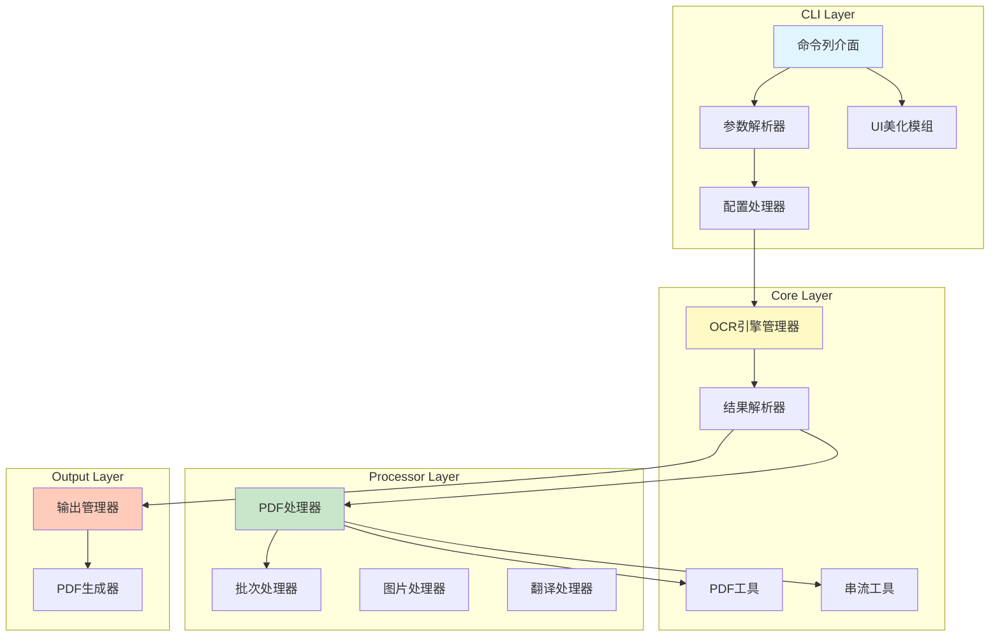
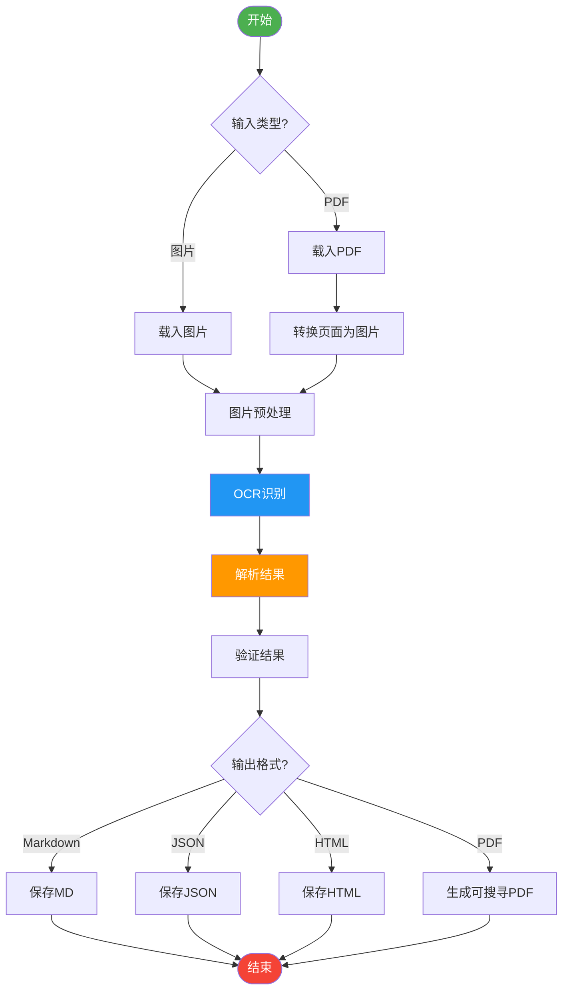

# 架构图与流程图

本文档包含PaddleOCR Toolkit的架构图和工作流程图。

---

## 系统架构图

```mermaid
graph TB
    subgraph "CLI Layer"
        CLI[命令列介面]
        ArgParser[参数解析器]
        ConfigHandler[配置处理器]
        RichUI[UI美化模组]
    end
    
    subgraph "Core Layer"
        OCREngine[OCR引擎管理器]
        ResultParser[结果解析器]
        PDFUtils[PDF工具]
        StreamUtils[串流工具]
    end
    
    subgraph "Processor Layer"
        BatchProc[批次处理器]
        PDFProc[PDF处理器]
        ImgProc[图片处理器]
        TransProc[翻译处理器]
    end
    
    subgraph "Output Layer"
        OutputMgr[输出管理器]
        PDFGen[PDF生成器]
    end
    
    CLI --> ArgParser
    ArgParser --> ConfigHandler
    CLI --> RichUI
    ConfigHandler --> OCREngine
    OCREngine --> ResultParser
    ResultParser --> PDFProc
    PDFProc --> PDFUtils
    PDFProc --> StreamUtils
    PDFProc --> BatchProc
    ResultParser --> OutputMgr
    OutputMgr --> PDFGen
    
    style CLI fill:#e1f5ff
    style OCREngine fill:#fff9c4
    style PDFProc fill:#c8e6c9
    style OutputMgr fill:#ffccbc
```

---

## OCR处理流程

```mermaid
flowchart TD
    Start([开始]) --> Input{输入类型?}
    
    Input -->|图片| LoadImg[载入图片]
    Input -->|PDF| LoadPDF[载入PDF]
    
    LoadPDF --> ConvertPage[转换页面为图片]
    LoadImg --> Preprocess[图片预处理]
    ConvertPage --> Preprocess
    
    Preprocess --> OCR[OCR识别]
    OCR --> Parse[解析结果]
    Parse --> Validate[验证结果]
    
    Validate --> Output{输出格式?}
    
    Output -->|Markdown| SaveMD[保存MD]
    Output -->|JSON| SaveJSON[保存JSON]
    Output -->|HTML| SaveHTML[保存HTML]
    Output -->|PDF| GenPDF[生成可搜寻PDF]
    
    SaveMD --> End([结束])
    SaveJSON --> End
    SaveHTML --> End
    GenPDF --> End
    
    style Start fill:#4caf50,color:#fff
    style End fill:#f44336,color:#fff
    style OCR fill:#2196f3,color:#fff
    style Parse fill:#ff9800,color:#fff
```

**使用Mermaid渲染这些图表以获得最佳视觉效果。**
