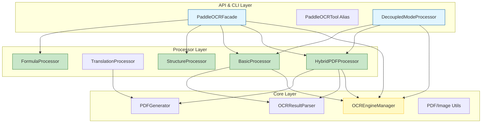
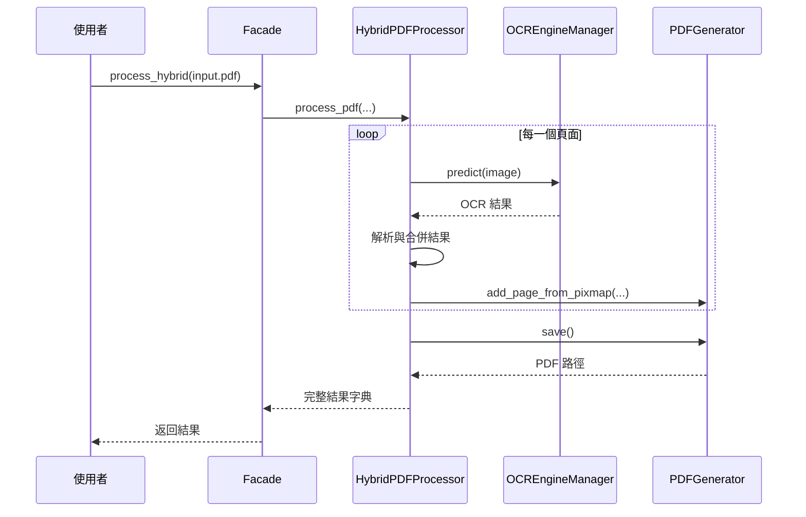

# 系統架構說明 (Architecture)

> PaddleOCR Toolkit 2.0.0 模組化架構

---

## 🚀 核心設計理念

專案採用 **Facade 模式** 與 **Processor 模式** 的組合，實現了高度解耦的模組化架構：
1. **Facade 層**：提供單一且向後相容的入口點。
2. **Processor 層**：將不同 OCR 模式的複雜邏輯封裝在專業的處理器中。
3. **Core 層**：提供底層引擎管理、PDF 處理與結果解析的基礎組件。

---

## 🏗️ 系統架構圖

---

## 🔄 核心處理流程 (以 Hybrid 模式為例)

---

## 📂 模組職責說明

### 1. API 層 (`paddle_ocr_facade.py`)
- 提供輕量化的 API 入口。
- 負責路由請求到正確的 Processor。
- 確保向後相容性。

### 2. Processor 層 (`paddleocr_toolkit/processors/`)
- **HybridPDFProcessor**: 處理版面分析與精確 OCR 的混合模式。
- **TranslationProcessor**: 處理翻譯流程與雙語 PDF 生成。
- **BasicProcessor**: 處理高效率的基本文字識別。
- **StructureProcessor**: 處理表格識別與文件結構解析。
- **FormulaProcessor**: 處理數學公式識別。

### 3. Core 層 (`paddleocr_toolkit/core/`)
- **OCREngineManager**: 統一管理 PaddleOCR 引擎的初始化與生命週期。
- **OCRResultParser**: 將引擎的原生輸出解析為結構化的 `OCRResult` 物件。
- **PDFGenerator**: 提供高效的 PDF 文字層生成與圖片壓縮功能。

---

## 🛠️ 擴充指南

若要新增 OCR 模式，請遵循以下步驟：
1. 在 `paddleocr_toolkit/processors/` 建立新的 `your_mode_processor.py`。
2. 實作處理邏輯，並使用 `OCREngineManager` 獲取引擎。
3. 在 `PaddleOCRFacade` 的 `_init_processors` 中註冊該處理器。
4. 在 `PaddleOCRFacade` 中加入對應的橋接方法。

---

> 更多詳細資訊請參閱 [MIGRATION_GUIDE.md](MIGRATION_GUIDE.md) 與 [FACADE_API_GUIDE.md](FACADE_API_GUIDE.md)。
