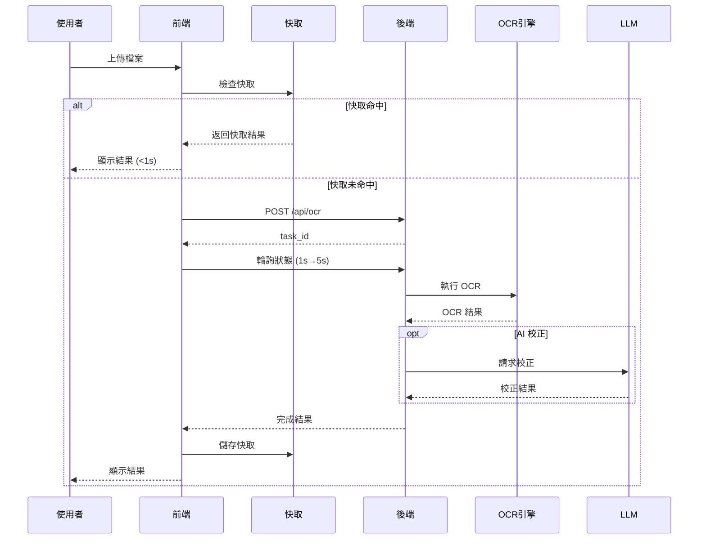
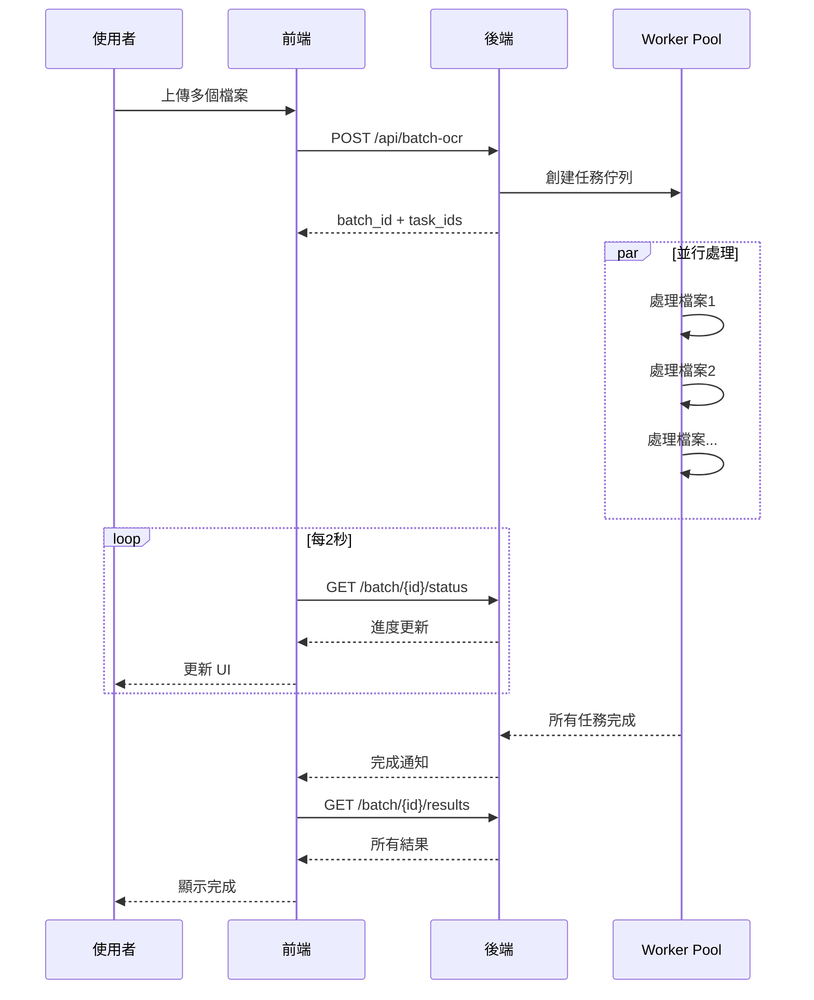

# PaddleOCR Toolkit - 系統藍圖 (Blueprint)

**版本**：v3.6.0 → v4.0.0  
**日期**：2026-01-01  
**狀態**：生產就緒

---

## 📋 目錄

1. [系統架構](#系統架構)
2. [技術棧](#技術棧)
3. [API 設計](#api-設計)
4. [數據流](#數據流)
5. [部署架構](#部署架構)
6. [開發路線圖](#開發路線圖)
7. [擴展計劃](#擴展計劃)

---

## 🏗️ 系統架構

### 整體架構圖

```
┌─────────────────────────────────────────────────────────────┐
│                        使用者層                              │
├─────────────────────────────────────────────────────────────┤
│  Web 瀏覽器  │  手機瀏覽器  │  API 客戶端                    │
└──────┬──────────────┬──────────────┬────────────────────────┘
       │              │              │
       └──────────────┴──────────────┘
                      │
              ┌───────▼───────┐
              │   CDN/Vercel  │ (前端)
              └───────┬───────┘
                      │ API 請求
              ┌───────▼────────┐
              │  FastAPI 後端  │ (Python)
              └───────┬────────┘
                      │
       ┌──────────────┼──────────────┐
       │              │              │
   ┌───▼────┐   ┌────▼────┐   ┌────▼─────┐
   │PaddleOCR│   │  LLM    │   │ Storage  │
   │ Engine  │   │(Gemini/ │   │(Files/DB)│
   │         │   │ Claude) │   │          │
   └─────────┘   └─────────┘   └──────────┘
```

### 核心組件

#### 1. 前端層 (Frontend Layer)
```
web-frontend/
├── src/
│   ├── app/              # Next.js App Router
│   │   ├── page.tsx      # 主頁面（單檔案+批量）
│   │   ├── layout.tsx    # 佈局
│   │   └── globals.css   # 全域樣式
│   ├── components/       # React 組件
│   │   ├── Sidebar.tsx
│   │   ├── BatchUpload.tsx
│   │   ├── SettingsModal.tsx
│   │   └── TranslationModal.tsx
│   ├── hooks/            # 自訂 Hooks
│   │   └── useOCR.ts     # OCR 處理邏輯
│   ├── utils/            # 工具函數
│   │   ├── api.ts
│   │   └── ocr-cache.ts  # 快取管理
│   └── lib/
│       └── gtag.ts       # Google Analytics
└── package.json
```

**職責**：
- 使用者介面
- 檔案上傳
- 進度顯示
- 結果展示
- 快取管理

#### 2. 後端層 (Backend Layer)
```
paddleocr_toolkit/
├── api/
│   └── main.py           # FastAPI 應用
│       ├── 上傳端點
│       ├── 任務追蹤
│       ├── 批量處理
│       ├── PDF 生成
│       └── 速率限制
├── core/
│   └── ocr_engine.py     # OCR 引擎核心
│       ├── Basic 模式
│       ├── Hybrid 模式
│       └── 結果處理
├── llm/
│   ├── llm_client.py     # LLM 抽象層
│   ├── gemini_client.py  # Gemini 整合
│   └── claude_client.py  # Claude 整合
└── plugins/              # 插件系統
    └── [自訂插件]
```

**職責**：
- OCR 處理
- AI 校正
- 批量管理
- PDF 生成
- 資源管理

#### 3. 儲存層 (Storage Layer)
```
uploads/                  # 上傳檔案
outputs/                  # 輸出檔案
.cache/                   # 快取數據
```

**職責**：
- 檔案儲存
- 臨時資料
- 快取管理

---

## 🛠️ 技術棧

### 前端技術
| 技術          | 版本 | 用途       |
| ------------- | ---- | ---------- |
| Next.js       | 14+  | React 框架 |
| React         | 18+  | UI 框架    |
| TypeScript    | 5+   | 類型安全   |
| CSS Variables | -    | 樣式系統   |

### 後端技術
| 技術      | 版本   | 用途     |
| --------- | ------ | -------- |
| Python    | 3.9+   | 核心語言 |
| FastAPI   | 0.104+ | Web 框架 |
| PaddleOCR | 2.8.1  | OCR 引擎 |
| PyMuPDF   | -      | PDF 處理 |
| ReportLab | -      | PDF 生成 |

### 基礎設施
| 服務             | 用途     |
| ---------------- | -------- |
| Vercel           | 前端託管 |
| ngrok/Railway    | 後端託管 |
| GitHub Actions   | CI/CD    |
| Google Analytics | 使用分析 |

---

## 🔌 API 設計

### RESTful API 端點

#### 1. OCR 處理
```
POST /api/ocr
Content-Type: multipart/form-data

Body:
- file: File (必需)
- mode: string (basic|hybrid)
- gemini_key: string (可選)
- claude_key: string (可選)

Response:
{
  "task_id": "uuid",
  "status": "queued",
  "message": "任務已創建"
}

速率限制: 10 次/分鐘
```

#### 2. 任務狀態查詢
```
GET /api/tasks/{task_id}

Response:
{
  "task_id": "uuid",
  "status": "completed|processing|failed",
  "progress": 100,
  "results": {
    "raw_result": "辨識文字",
    "page_results": ["頁面1", "頁面2"],
    "pages": 2,
    "confidence": 0.95
  }
}
```

#### 3. 批量處理
```
POST /api/batch-ocr
Content-Type: multipart/form-data

Body:
- files: File[] (最多20個)
- mode: string
- gemini_key: string (可選)
- claude_key: string (可選)

Response:
{
  "batch_id": "uuid",
  "task_ids": ["uuid1", "uuid2", ...],
  "total": 5
}

速率限制: 3 次/分鐘
```

#### 4. 批量狀態查詢
```
GET /api/batch/{batch_id}/status

Response:
{
  "batch_id": "uuid",
  "total": 5,
  "completed": 3,
  "failed": 0,
  "processing": 2,
  "progress": 60.0,
  "tasks": [
    {
      "task_id": "uuid",
      "file_name": "file.pdf",
      "status": "completed",
      "progress": 100
    }
  ]
}
```

#### 5. 可搜尋 PDF
```
GET /api/tasks/{task_id}/searchable-pdf

Response: PDF 檔案流
Content-Type: application/pdf
Content-Disposition: attachment; filename="searchable_ocr_result.pdf"
```

### API 特性

#### 速率限制
```python
# 單檔案 OCR
@limiter.limit("10/minute")

# 批量處理
@limiter.limit("3/minute")
```

#### 錯誤處理
```json
{
  "detail": "錯誤訊息",
  "status_code": 400|401|403|404|429|500
}
```

#### CORS 設定
```python
allow_origins = [
  "http://localhost:3000",
  "https://*.vercel.app"
]
```

---

## 🔄 數據流

### 單檔案 OCR 流程



### 批量處理流程



---

## ☁️ 部署架構

### 當前部署（開發/測試）

```
┌─────────────────┐
│   使用者端      │
└────────┬────────┘
         │ HTTPS
    ┌────▼─────┐
    │  Vercel  │ (前端 CDN)
    └────┬─────┘
         │ API
    ┌────▼─────┐
    │  ngrok   │ (通道)
    └────┬─────┘
         │
    ┌────▼─────┐
    │ 本地後端  │ (FastAPI)
    └──────────┘

特點:
- 免費
- 快速開發
- 需要本機運行
```

### 建議生產部署

```
┌─────────────────┐
│   使用者端      │
└────────┬────────┘
         │ HTTPS
    ┌────▼─────┐
    │  Vercel  │ (前端 CDN)
    └────┬─────┘
         │ API
    ┌────▼─────┐
    │ Railway  │ (後端容器)
    │ or       │
    │CloudRun  │
    └────┬─────┘
         │
    ┌────▼─────┐
    │ Database │ (可選)
    │ Storage  │
    └──────────┘

特點:
- 24/7 可用
- 自動擴展
- 固定 URL
成本: $5-40/月
```

---

## 🗺️ 開發路線圖

### v3.6.0 (當前) ✅

**已完成**：
- ✅ Clean Slate UI
- ✅ 批量處理
- ✅ 智能快取
- ✅ 速率限制
- ✅ 錯誤重試
- ✅ CI/CD

### v3.7.0 (短期 - 1-2週)

**計劃功能**：
- [ ] 批量結果批次下載
- [ ] 拖放檔案支援
- [ ] 快取管理 UI
- [ ] 使用統計儀表板
- [ ] 更多檔案格式支援

**預計工作量**：20-30 小時

### v4.0.0 (中期 - 1-2月)

**重大功能**：

#### 1. WebSocket 即時通知
```typescript
// 替代輪詢
const ws = new WebSocket('ws://api/tasks/stream');
ws.onmessage = (event) => {
  const data = JSON.parse(event.data);
  updateProgress(data.progress);
};
```

#### 2. 使用者認證系統
```
- JWT 認證
- 使用者註冊/登入
- 配額管理
- 使用歷史
```

#### 3. GPU 支援
```python
if torch.cuda.is_available():
    ocr_engine = OCREngine(use_gpu=True)
    # 效能提升 5-10x
```

#### 4. 資料庫整合
```sql
CREATE TABLE users (
  id UUID PRIMARY KEY,
  email VARCHAR,
  quota_limit INT,
  usage_count INT
);

CREATE TABLE ocr_history (
  id UUID PRIMARY KEY,
  user_id UUID,
  file_name VARCHAR,
  created_at TIMESTAMP,
  result JSONB
);
```

#### 5. 進階功能
- 歷史記錄查詢
- 結果比較
- 批次編輯
- 模板系統
- API Key 管理

**預計工作量**：80-120 小時

### v5.0.0 (長期 - 6月+)

**企業級功能**：
- 多租戶支援
- 白標籤選項
- 高級分析
- SSO 整合
- SLA 保證
- 專業支援

---

## 🔧 擴展計劃

### 水平擴展

#### 負載平衡
```
    ┌─────────┐
    │  LB     │
    └────┬────┘
         │
    ┌────┴────┐
    │         │
┌───▼──┐  ┌──▼───┐
│API-1 │  │API-2 │
└──────┘  └──────┘
```

#### 微服務化
```
┌──────────┐  ┌──────────┐  ┌──────────┐
│   API    │  │   OCR    │  │   LLM    │
│ Gateway  │─▶│ Service  │─▶│ Service  │
└──────────┘  └──────────┘  └──────────┘
     │             │             │
     └─────────────┴─────────────┘
                   │
              ┌────▼────┐
              │  Queue  │
              │ (Redis) │
              └─────────┘
```

### 垂直擴展

#### 效能優化
- GPU 加速 OCR
- 模型量化
- 結果快取層（Redis）
- CDN 靜態資源

#### 儲存優化
- S3/Cloud Storage
- 壓縮演算法
- 自動歸檔

---

## 📊 監控與分析

### 監控指標

```python
# 效能指標
- OCR 處理時間
- API 響應時間
- 快取命中率
- 錯誤率

# 業務指標
- 日活躍使用者
- 處理檔案數
- 成功率
- 平均檔案大小
```

### 日誌系統

```python
import logging

logger.info("OCR started", extra={
    "task_id": task_id,
    "file_size": file.size,
    "mode": mode
})
```

### 告警系統

```yaml
alerts:
  - name: high_error_rate
    condition: error_rate > 5%
    action: notify_slack
  
  - name: slow_response
    condition: avg_response_time > 10s
    action: notify_email
```

---

## 🔐 安全藍圖

### 當前安全措施

1. **速率限制**
   - API 端點限制
   - IP 基礎追蹤

2. **輸入驗證**
   - 檔案大小限制
   - 檔案類型檢查

3. **CORS 設定**
   - 允許來源控制

### 未來安全增強

1. **認證授權**
   ```
   - JWT Token
   - API Key
   - OAuth2
   ```

2. **加密**
   ```
   - HTTPS 強制
   - 檔案加密儲存
   - 敏感資料加密
   ```

3. **審計**
   ```
   - 操作日誌
   - 訪問記錄
   - 異常檢測
   ```

---

## 📝 總結

### 當前狀態

**系統完成度**：✅ 100%
- 核心功能：完整
- 效能優化：優秀
- 代碼品質：高
- 文檔：齊全
- CI/CD：自動化

### 下一階段重點

**短期（v3.7.0）**：
- 使用者體驗改善
- 小功能增強

**中期（v4.0.0）**：
- 架構升級
- 企業級功能
- 效能提升

**長期（v5.0.0）**：
- 商業化準備
- 多租戶支援
- 專業服務

---

**PaddleOCR Toolkit Blueprint**  
**版本**：v3.6.0  
**狀態**：生產就緒  
**未來**：持續進化

🚀 **準備好迎接下一階段的發展！**
